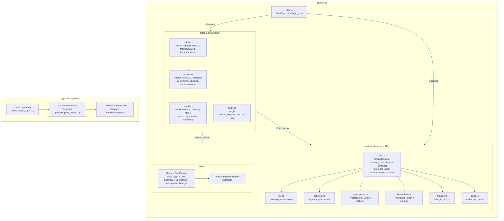

# Apollonius 🌌


**Apollonius** is a lightweight, high-performance N-dimensional geometry library for Rust. It provides the mathematical and structural foundations for physics engines, collision detection systems, and spatial simulations using `const generics`.

## 📐 Library architecture (Mermaid)

Logical flow and relationships between modules. **Algebra** is the base; **primitives** build on it and share the **SpatialRelation** / **Bounded** / **IntersectionResult** API; **space** and **utils** support transforms and float handling.



- **Algebra:** All types use `T: Float` (num_traits). Points and vectors are the coordinate types; **Matrix** (with type tags `General`, `Isometry`, `Affine` and traits `MatrixTag`, `IsAffine`, `IsIsometry`) and **Angle** extend the toolbox.
- **Primitives:** Each shape implements `SpatialRelation` (and often `Bounded`). Intersections between them return `IntersectionResult<T, N>` (None, Tangent, Secant, Collinear, Single, HalfSpacePenetration).
- **Space:** **AffineTransform** (linear part + translation); **linear_ops**: `Matrix × Point/Vector` and `Matrix` / `AffineTransform` × Line, Segment, Hypersphere, Hyperplane, Triangle. Isometry tag required for hypersphere (radius preserved).
- **Utils:** `classify_to_zero` and `FloatSign` for robust float comparisons in primitives and algebra.

## ✨ Key Features

* **N-Dimensional Support:** Type-safe coordinates and vectors for 2D, 3D, and higher-dimensional spaces using Rust's `const generics`.
* **Efficient Primitives:**
    * **Hyperspheres:** (Circles, Spheres, N-Spheres) with plane intersection and submerged volume ratio.
    * **Lines & Segments:** Infinite lines and finite segments with parametric evaluation, projection, and full intersection APIs.
    * **Hyperplanes:** Half-space queries, signed distance, and intersection with lines, segments, and hyperspheres.
    * **Triangles:** N-dimensional triangles with centroid, area (Lagrange identity), and AABB.
* **Broad-Phase Foundations:** Native support for **AABB** (Axis-Aligned Bounding Boxes) with optimized overlap theorems.
* **Unified Intersection Engine:** A single `IntersectionResult` type covering:
    * **None**, **Tangent**(point), **Secant**(p1, p2), **Collinear**, **Single**(point) for point-like contacts.
    * **HalfSpacePenetration**(depth) for hypersphere–hyperplane penetration.
* **Point-to-Point Intersections:** Line∩Line, Line∩Segment, Line∩Hypersphere, Line∩Hyperplane; Segment∩Segment, Segment∩Hypersphere, Segment∩Hyperplane, Segment∩Line; Hyperplane∩Line, Hyperplane∩Segment, Hyperplane∩Hypersphere; Hypersphere∩Line, Hypersphere∩Segment, Hypersphere∩Hyperplane.
* **Numerical Stability:** Robust floating-point classification via `classify_to_zero` and `FloatSign` to handle accumulation errors.
* **Type-safe matrices:** Tags `General`, `Isometry`, `Affine` and traits `MatrixTag`, `IsAffine`, `IsIsometry` so you can restrict functions to specific matrix kinds (e.g. only isometries acting on hyperspheres).
* **Prelude and re-exports:** All main types and traits are re-exported at the crate root. Use `use apollonius::prelude::*` for one-shot imports (points, vectors, matrices, primitives, metric traits).

## 🛠 Technical Stack

* **Language:** Rust (Stable)
* **Math Traits:** `num-traits` for generic support over `f32` and `f64`.
* **Core Philosophy:** Minimal dependencies; core logic is independent of rendering or external physics frameworks.

## 📦 Installation

Add this to your `Cargo.toml`:

```toml
[dependencies]
apollonius = "0.1"
```

Optional **serde** for serialization:

```toml
apollonius = { version = "0.1", features = ["serde"] }
```

**Importing:** Use the crate root or the prelude. All core types and traits are re-exported:

```rust
// Explicit imports from the crate root
use apollonius::{Point, Vector, Matrix, General, Isometry, Affine, Line, Hypersphere};

// Or bring in the most used items in one go (includes metric traits for distances/magnitudes)
use apollonius::prelude::*;
```

## 📖 Quick Example: Line–Hypersphere Intersection

```rust
use apollonius::{Point, Vector, Line, Hypersphere, IntersectionResult};

let line = Line::new(Point::new([-5.0, 0.0]), Vector::new([1.0, 0.0]));
let sphere = Hypersphere::new(Point::new([0.0, 0.0]), 2.0);

match line.intersect_hypersphere(&sphere) {
    IntersectionResult::Secant(p1, p2) => println!("Intersects at {:?} and {:?}", p1, p2),
    IntersectionResult::Tangent(p) => println!("Grazing contact at {:?}", p),
    _ => println!("No intersection"),
}
```

## 📖 Matrices and affine transforms

Matrices are type-tagged: **General** (any N×N), **Isometry** (rotations; preserve distances), **Affine** (used in affine context). You can multiply them by points, vectors, and by primitives (Line, Segment, Hypersphere, Hyperplane, Triangle). **AffineTransform** = linear part + translation.

### Matrix × Point and Matrix × Vector

```rust
use apollonius::{General, Matrix, Point, Vector};

// Identity leaves point and vector unchanged
let id = Matrix::<f64, 2, General>::identity();
let p = Point::new([3.0, 4.0]);
let v = Vector::new([1.0, 0.0]);
assert_eq!(id * p, p);
assert_eq!(id * v, v);

// General 2×2 matrix: row-major construction
let m = Matrix::<_, 2, General>::new([[1.0, 2.0], [3.0, 4.0]]);
let out = m * Vector::new([1.0, 1.0]);
assert_eq!(out.coords_ref(), &[3.0, 7.0]);
```

### 2D rotation (Isometry)

```rust
use apollonius::{Angle, Isometry, Matrix, Point, Vector};
use std::f64::consts::FRAC_PI_2;

// Rotate 90° counterclockwise in the plane
let rot = Matrix::<f64, 2, Isometry>::rotation_2d(Angle::<f64>::from_radians(FRAC_PI_2));
let v = Vector::new([1.0, 0.0]);
let rotated = rot * v;
// (1, 0) → (0, 1)
assert!((rotated.coords_ref()[0] - 0.0).abs() < 1e-10);
assert!((rotated.coords_ref()[1] - 1.0).abs() < 1e-10);
```

### AffineTransform: translate and rotate

```rust
use apollonius::{AffineTransform, Angle, Isometry, Line, Matrix, Point, Vector};

let linear = Matrix::<f64, 2, Isometry>::rotation_2d(Angle::<f64>::from_radians(std::f64::consts::FRAC_PI_2));
let translation = Vector::new([10.0, 0.0]);
let tr = AffineTransform::new(linear, translation);

let line = Line::new(Point::new([0.0, 0.0]), Vector::new([1.0, 0.0]));
let transformed = tr * line;
// Origin and direction are transformed; direction is re-normalized
println!("New origin: {:?}", transformed.origin());
```

### Matrix × Hypersphere (isometries preserve radius)

Only **isometric** matrices (and affine transforms with isometric linear part) can act on hyperspheres, so the radius is preserved:

```rust
use apollonius::{Angle, Hypersphere, Isometry, Matrix, Point};

let rot = Matrix::<f64, 2, Isometry>::rotation_2d(Angle::<f64>::from_radians(1.0));
let circle = Hypersphere::new(Point::new([1.0, 0.0]), 5.0);
let rotated_circle = rot * circle;
assert_eq!(rotated_circle.radius(), 5.0);  // unchanged
// Center is rotated: rot * circle.center()
```

### Constraining functions by matrix kind

Use the traits `MatrixTag`, `IsAffine`, or `IsIsometry` to restrict generic functions. The type system ensures only isometries act on hyperspheres (radius is preserved):

```rust
use apollonius::{Hypersphere, IsIsometry, Matrix};

/// Only matrices with tag implementing IsIsometry (e.g. Isometry) are accepted.
fn rotate_sphere<const N: usize, Tag>(rot: Matrix<f64, N, Tag>, sphere: Hypersphere<f64, N>) -> Hypersphere<f64, N>
where
    Tag: IsIsometry,
{
    rot * sphere
}
```

## 📖 Example: Hypersphere–Hyperplane (Tangent vs Penetration)

```rust
use apollonius::{Point, Vector, Hypersphere, Hyperplane, IntersectionResult};

let sphere = Hypersphere::new(Point::new([0.0, 0.0, 5.0]), 5.0);
let plane = Hyperplane::new(Point::new([0.0, 0.0, 0.0]), Vector::new([0.0, 0.0, 1.0]));

match sphere.intersect_hyperplane(&plane) {
    IntersectionResult::Tangent(p) => println!("Sphere touches plane at {:?}", p),
    IntersectionResult::HalfSpacePenetration(depth) => println!("Penetration depth: {}", depth),
    IntersectionResult::None => println!("No contact"),
    _ => {}
}
```

## 📖 Example: Segment, AABB, and closest point

```rust
use apollonius::prelude::*;

let seg = Segment::new(Point::new([0.0, 0.0]), Point::new([2.0, 0.0]));
let aabb = seg.aabb();
assert_eq!(aabb.min_ref(), &[0.0, 0.0]);
assert_eq!(aabb.max_ref(), &[2.0, 0.0]);

let query = Point::new([1.0, 3.0]);
let closest = seg.closest_point(&query);
assert_eq!(closest.coords_ref(), &[1.0, 0.0]);  // foot on segment
let dist_sq = seg.distance_to_point_squared(&query);
assert!((dist_sq - 9.0).abs() < 1e-10);
```

## 🛰 Roadmap

- [x] N-dimensional Point & Vector algebra.
- [x] Core primitives (Hypersphere, Line, Segment, Hyperplane, AABB, Triangle).
- [x] AABB broad-phase overlap.
- [x] Point-result intersections: Line/Segment with Line, Segment, Hypersphere, Hyperplane; Hyperplane with Line, Segment, Hypersphere; Hypersphere with Line, Segment, Hyperplane.
- [x] Hypersphere–Hyperplane: tangent contact, half-space penetration, `submerged_ratio`.
- [x] Documentation and doc tests.
- [x] **v0.1.0:** Type-tagged matrices (General, Isometry, Affine), AffineTransform, linear_ops (Matrix/AffineTransform × Point, Vector, Line, Segment, Hypersphere, Hyperplane, Triangle). Prelude and crate-root re-exports.
- [ ] GJK (Gilbert–Johnson–Keerthi) for narrow-phase.
- [ ] Oriented Bounding Boxes (OBB).
- [ ] Spatial partitioning (BVH / quadtree).

## 📝 License

This project is licensed under the MIT License.

---

**Developed with 🦀 by Mauricio Klainbard**
