# Apollonius 🌌


**Apollonius** is a lightweight, high-performance N-dimensional geometry library for Rust. It provides the mathematical and structural foundations for physics engines, collision detection systems, and spatial simulations using `const generics`.

## 📐 Library architecture (Mermaid)

Logical flow and relationships between modules. **Algebra** is the base; **primitives** build on it and share the **SpatialRelation** / **Bounded** / **IntersectionResult** API; **space** and **utils** support transforms and float handling.

```mermaid
flowchart TB
    subgraph ROOT["apollonius"]
        direction TB
        subgraph ALGEBRA["algebra (foundation)"]
            direction TB
            POINTS["points.rs<br/>Point, Point2D, Point3D<br/>MetricSquared, EuclideanMetric"]
            VECTORS["vectors.rs<br/>Vector, Vector2D, Vector3D<br/>VectorMetricSquared, EuclideanVector"]
            MATRIX["matrix.rs<br/>Matrix (N×N)<br/>identity, +, −, ×, ×Vector, ×Point"]
            ANGLE["angle.rs<br/>Angle<br/>radians, degrees, sin, cos, tan"]
            POINTS --> VECTORS
            VECTORS --> MATRIX
        end

        subgraph PRIMITIVES["primitives (shapes + API)"]
            direction TB
            TRAITS["mod.rs<br/>SpatialRelation (closest_point, distance, contains)<br/>Bounded (aabb)<br/>IntersectionResult enum"]
            LINE["line.rs<br/>Line (origin + direction)"]
            SEG["segment.rs<br/>Segment (start + end)"]
            AABB["aabb.rs<br/>AABB (min, max)"]
            SPHERE["hypersphere.rs<br/>Hypersphere / Circle / Sphere"]
            PLANE["hyperplane.rs<br/>Hyperplane (origin + normal)"]
            TRI["triangle.rs<br/>Triangle (a, b, c)"]
            TRAITS --> LINE
            TRAITS --> SEG
            TRAITS --> SPHERE
            TRAITS --> PLANE
            TRAITS --> TRI
            TRAITS --> AABB
        end

        subgraph SPACE["space"]
            LINEAR["LinearMap (Rotation)"]
            AFFINE["AffineTransform (linear + translation)"]
            LINEAR --> AFFINE
        end

        UTILS["utils.rs<br/>FloatSign, classify_to_zero"]
    end

    ALGEBRA -->|"Point, Vector"| PRIMITIVES
    ALGEBRA -->|"Matrix, Vector"| SPACE
    UTILS -->|"tolerance"| PRIMITIVES
    UTILS -->|"tolerance"| ALGEBRA

    subgraph FLOW["Typical usage flow"]
        direction LR
        F1["1. Build geometry<br/>(Point, Vector, Line, …)"]
        F2["2. SpatialRelation / Bounded<br/>(closest_point, aabb, …)"]
        F3["3. Intersection methods<br/>(intersect_*, IntersectionResult)"]
        F1 --> F2 --> F3
    end
```



- **Algebra:** All types use `T: Float` (num_traits). Points and vectors are the coordinate types; Matrix and Angle extend the toolbox.
- **Primitives:** Each shape implements `SpatialRelation` (and often `Bounded`). Intersections between them return `IntersectionResult<T, N>` (None, Tangent, Secant, Collinear, Single, HalfSpacePenetration).
- **Space:** Affine transforms (rotation via Matrix, translation via Vector) for transforming points/vectors later.
- **Utils:** `classify_to_zero` and `FloatSign` for robust float comparisons in primitives and algebra.

## ✨ Key Features

* **N-Dimensional Support:** Type-safe coordinates and vectors for 2D, 3D, and higher-dimensional spaces using Rust's `const generics`.
* **Efficient Primitives:**
    * **Hyperspheres:** (Circles, Spheres, N-Spheres) with plane intersection and submerged volume ratio.
    * **Lines & Segments:** Infinite lines and finite segments with parametric evaluation, projection, and full intersection APIs.
    * **Hyperplanes:** Half-space queries, signed distance, and intersection with lines, segments, and hyperspheres.
    * **Triangles:** N-dimensional triangles with centroid, area (Lagrange identity), and AABB.
* **Broad-Phase Foundations:** Native support for **AABB** (Axis-Aligned Bounding Boxes) with optimized overlap theorems.
* **Unified Intersection Engine:** A single `IntersectionResult` type covering:
    * **None**, **Tangent**(point), **Secant**(p1, p2), **Collinear**, **Single**(point) for point-like contacts.
    * **HalfSpacePenetration**(depth) for hypersphere–hyperplane penetration.
* **Point-to-Point Intersections:** Line∩Line, Line∩Segment, Line∩Hypersphere, Line∩Hyperplane; Segment∩Segment, Segment∩Hypersphere, Segment∩Hyperplane, Segment∩Line; Hyperplane∩Line, Hyperplane∩Segment, Hyperplane∩Hypersphere; Hypersphere∩Line, Hypersphere∩Segment, Hypersphere∩Hyperplane.
* **Numerical Stability:** Robust floating-point classification via `classify_to_zero` and `FloatSign` to handle accumulation errors.

## 🛠 Technical Stack

* **Language:** Rust (Stable)
* **Math Traits:** `num-traits` for generic support over `f32` and `f64`.
* **Core Philosophy:** Minimal dependencies; core logic is independent of rendering or external physics frameworks.

## 📦 Installation

Add this to your `Cargo.toml`:

```toml
[dependencies]
apollonius = "0.0.6-alpha"
```

## 📖 Quick Example: Line–Hypersphere Intersection

```rust
use apollonius::{Point, Vector, Line, Hypersphere, IntersectionResult};

let line = Line::new(Point::new([-5.0, 0.0]), Vector::new([1.0, 0.0]));
let sphere = Hypersphere::new(Point::new([0.0, 0.0]), 2.0);

match line.intersect_hypersphere(&sphere) {
    IntersectionResult::Secant(p1, p2) => println!("Intersects at {:?} and {:?}", p1, p2),
    IntersectionResult::Tangent(p) => println!("Grazing contact at {:?}", p),
    _ => println!("No intersection"),
}
```

## 📖 Example: Hypersphere–Hyperplane (Tangent vs Penetration)

```rust
use apollonius::{Point, Vector, Hypersphere, Hyperplane, IntersectionResult};

let sphere = Hypersphere::new(Point::new([0.0, 0.0, 5.0]), 5.0);
let plane = Hyperplane::new(Point::new([0.0, 0.0, 0.0]), Vector::new([0.0, 0.0, 1.0]));

match sphere.intersect_hyperplane(&plane) {
    IntersectionResult::Tangent(p) => println!("Sphere touches plane at {:?}", p),
    IntersectionResult::HalfSpacePenetration(depth) => println!("Penetration depth: {}", depth),
    IntersectionResult::None => println!("No contact"),
    _ => {}
}
```

## 🛰 Roadmap

- [x] N-dimensional Point & Vector algebra.
- [x] Core primitives (Hypersphere, Line, Segment, Hyperplane, AABB, Triangle).
- [x] AABB broad-phase overlap.
- [x] Point-result intersections: Line/Segment with Line, Segment, Hypersphere, Hyperplane; Hyperplane with Line, Segment, Hypersphere; Hypersphere with Line, Segment, Hyperplane.
- [x] Hypersphere–Hyperplane: tangent contact, half-space penetration, `submerged_ratio`.
- [x] Documentation and doc tests.
- [ ] **v0.0.7:** Transformation matrices (affine: translation, scale, rotation; apply to Point/Vector).
- [ ] GJK (Gilbert–Johnson–Keerthi) for narrow-phase.
- [ ] Oriented Bounding Boxes (OBB).
- [ ] Spatial partitioning (BVH / quadtree).

## 📝 License

This project is licensed under the MIT License.

---

**Developed with 🦀 by Mauricio Klainbard**
